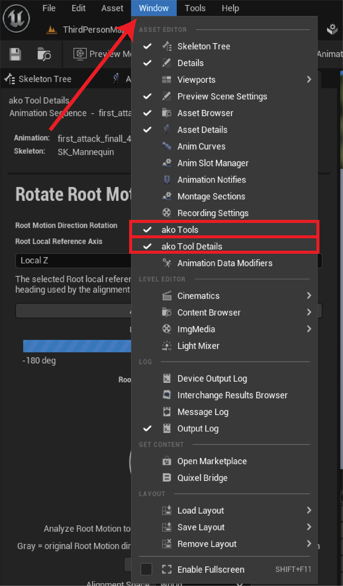
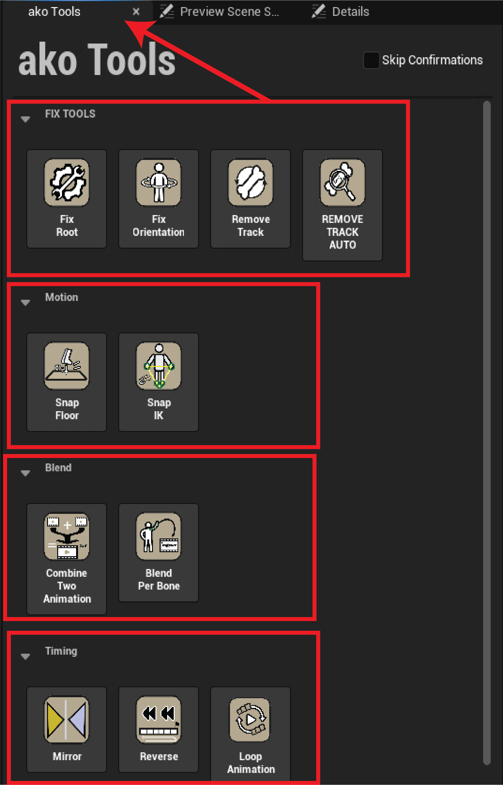
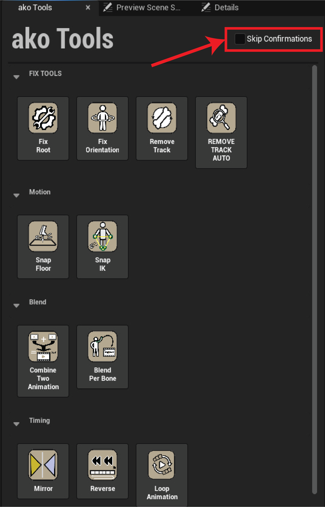

# First Use

## 1. Open an Animation Asset

Open an Animation Sequence or Animation Composite in Unreal Engine's Animation Editor.

## 2. Open ako Tools

Open **ako Tools** from the Animation Editor and choose the operation you need.

<figure><figcaption></figcaption></figure> <figure><figcaption></figcaption></figure>

## 3. Check the Active Asset

Before changing anything, confirm the animation and Skeleton shown in the tool window.

<figure><figcaption></figcaption></figure>

## 4. Configure the Tool

Choose the requested bones, options, ranges, sampling rate, or output asset depending on the tool.

## 5. Review Before Applying

Tools that provide an analysis step should be allowed to finish the analysis before the final operation is applied. Read the result area before continuing.

## <mark style="color:orange;">\*\*Skip Confirmations</mark>

When an Animation Sequence is open, **Skip Confirmations** can suppress confirmation prompts and successful-operation result messages. Validation still runs, and errors can still be reported.

<figure><figcaption></figcaption></figure>

For early testing, keeping confirmations enabled makes it easier to understand what each tool is doing.
