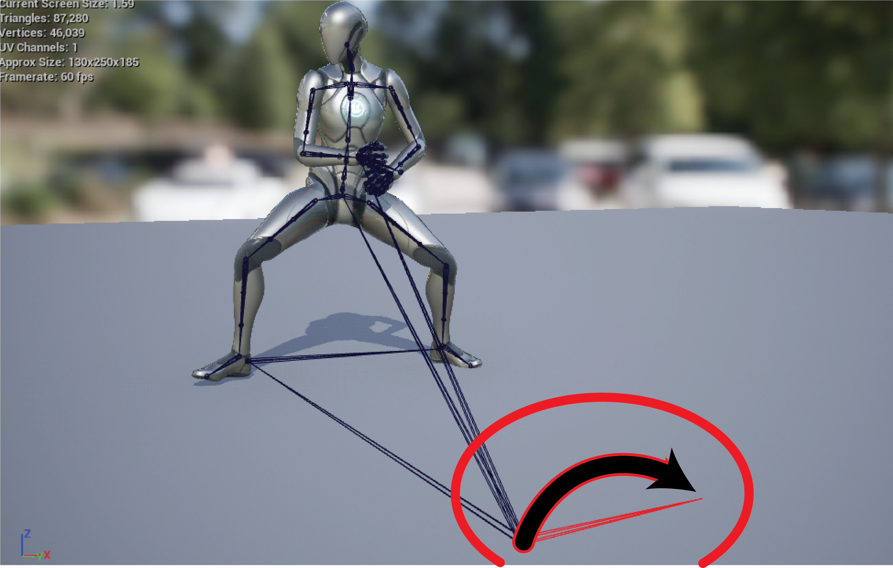
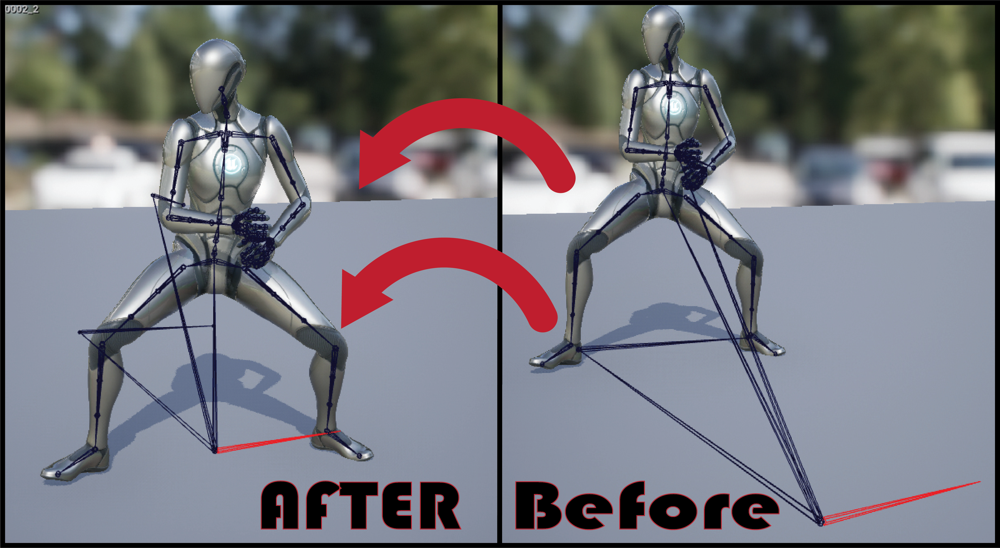

# Fix Root

## What It Does

Fix Root checks the Root at the beginning of the animation and provides a controlled Root/Pelvis correction workflow. 

{% embed url="https://files.gitbook.com/v0/b/gitbook-x-prod.appspot.com/o/spaces%2F6sAtdsTWUp3EFn3eOTvl%2Fuploads%2FXHfVZs0gdURZkrhVAKhd%2FROOT_FIX.mp4?alt=media&token=a72330d3-ed1b-4e96-9812-3f615b8b85ad" %}

The tool is designed for cases where the Root is not initialized correctly or when motion needs to be reorganized between the Root and Pelvis.\
\
<mark style="color:$warning;">The tools</mark> <mark style="color:$success;">automatically detect</mark> <mark style="color:$warning;">the</mark> <mark style="color:$danger;">Pelvis</mark> <mark style="color:$warning;">and</mark> <mark style="color:$danger;">Root</mark><mark style="color:$warning;">, but it’s always a good idea to double-check them.</mark>

<figure><figcaption></figcaption></figure>

<mark style="color:$success;">**This tools include 2 stage:**</mark>

## Stage 1 — Root Initial Position

Choose the **Root Bone** and review the Root position at frame 0.

Click **Check Root Position** to analyze the Root across the animation.

Depending on the analysis, the tool may provide:

* **Apply Additive Layer Fix**
* **Ignore / Continue**
* **Fix Root Position to 0, 0, 0**

<figure><figcaption></figcaption></figure>

<mark style="color:orange;">The next stage remains locked until the required checks and decisions are resolved.</mark>

## Stage 2 — Motion Transfer

Choose:

* Root Bone
* Pelvis Bone
* Transfer axes: X, Y, Z
* Transfer direction:\
  &#x20;Root → Pelvis to create <mark style="color:$success;">**in place animation**</mark> or Pelvis → Root to create <mark style="color:$success;">in place animation</mark>

<figure><figcaption></figcaption></figure>

### Full Motion

Transfers the Pelvis's complete component-space displacement from frame 0.

### Component Space

Transfers Pelvis motion relative to the Root.

## Requirements

* Root and Pelvis must be different bones.
* The Pelvis must be a descendant of the selected Root.
* At least one transfer axis must be selected when the workflow asks for axes.
* <mark style="color:orange;">This tool does not create Root Motion from nothing</mark>. The Pelvis must already contain <mark style="color:$warning;">movement</mark> that can be transferred to the Root. Otherwise, selecting Create Root Motion will result in an i<mark style="color:orange;">n-place animation.</mark>

## Important

-This is a staged workflow. Changing the selected Root or Pelvis after the initial analysis can require the first stage to be run again.\
-Once the tool has been applied and the animation is corrected, do not apply it again.
